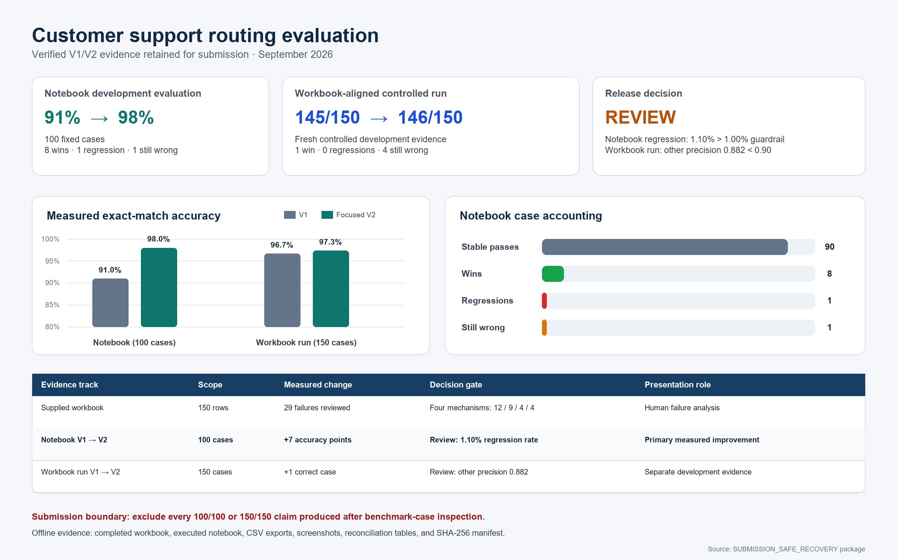
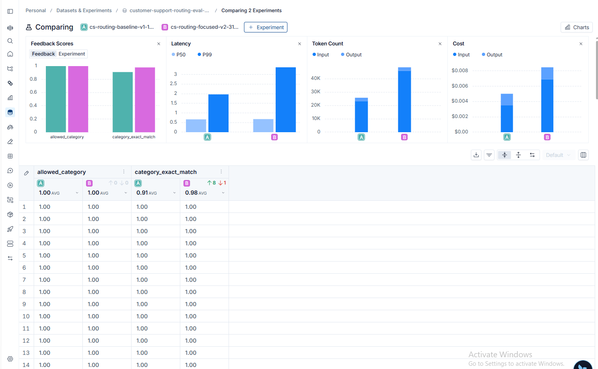
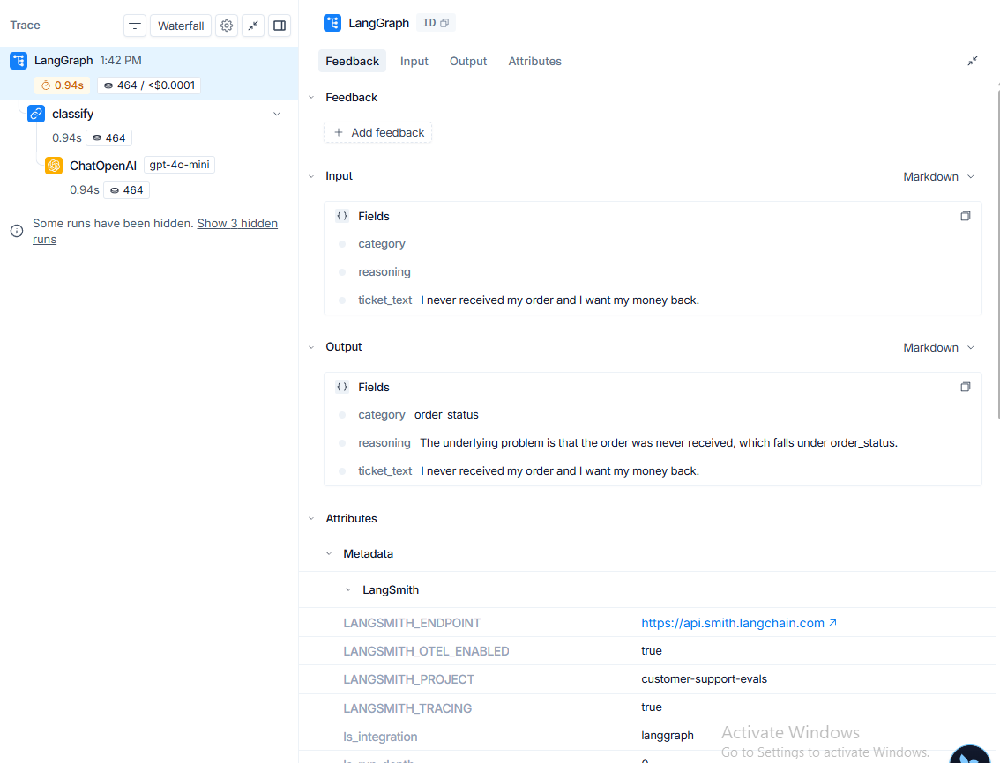
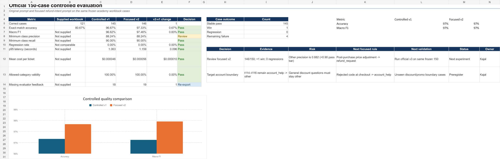

# Customer Support Agent Evaluation

> An evidence-first evaluation of a five-class customer-support routing agent, covering human error analysis, prompt iteration, LangSmith experiments, regression gates, and operational trade-offs.

**Author:** Kajal Chourasia

## Project links

| Deliverable | Link |
|---|---|
| Project documentation | [Open the full Google Doc](https://docs.google.com/document/d/1n_LMh7LhJMKXgKXJWg9dqDNyviztHkASilYU_eq0Izk/edit) |
| Case study | [Read the detailed 22-page PDF](docs/Customer_Support_Evaluation_Case_Study.pdf) |
| Case study source | [Read the accessible Markdown edition](docs/Customer_Support_Evaluation_Case_Study.md) |
| Completed evaluation workbook | [Download the completed workbook](workbook/Week4_Customer_Support_Evaluation_Kajal_completed.xlsx) |
| Executed notebook | [Open the V1/V2 evaluation notebook](notebook/week4_customer_support_evals_executed.ipynb) |
| Loom narration | [Read the word-for-word video transcript](docs/Loom_Recording_Transcript.md) |
| LangSmith experiment | [Open the V1/V2 comparison](https://smith.langchain.com/o/b995b149-5185-4abe-9dd5-28045024bbb5/datasets/d14c5f9c-800e-4c32-a962-c112a36d3916/compare?selectedSessions=33cdf37f-9c5f-4845-bddd-dc8143c47f7f%2C7e5de78b-82d0-4359-af2e-ce473e2e584f&source=33cdf37f-9c5f-4845-bddd-dc8143c47f7f) |



## The problem

The agent routes support tickets into five operational categories:

- `order_status`
- `refund_request`
- `product_issue`
- `account_help`
- `other`

A useful evaluation must answer more than “How many labels matched?” It must show which customer intents fail, whether a candidate fixes them without breaking previously correct behavior, and whether the quality gain justifies additional latency and cost.

This project therefore evaluates:

- exact-match accuracy and allowed-output validity;
- per-class precision, recall, and F1;
- wrong-to-right wins and right-to-wrong regressions;
- stable passes and remaining failures;
- latency, token consumption, and cost;
- representative traces and model reasoning;
- release gates and limitations.

## System architecture


The dataset supplies `ticket_text` to a LangGraph classification workflow. The model applies a category policy and returns structured output containing the chosen category and its reasoning. LangSmith records the root trace and child model run, while evaluators score category validity and exact match.

Reference labels are retained for evaluation and are not passed to the model as answers.

## Evaluation lifecycle


The workflow begins by defining the user outcome and costly failure modes. Examples and labels are then frozen, a baseline and candidate are run on the same data, and the comparison is analyzed through aggregate metrics, outcome transitions, slices, and traces. The declared gates produce a Pass, Review, or Fail decision. Reviewed production failures can later become new offline regression cases.

## Evidence design


Three evidence streams are reported separately because they serve different purposes and should not be merged into one causal claim.

| Evidence stream | Baseline | Candidate/result | What it supports |
|---|---:|---:|---|
| Supplied workbook audit | 121/150 correct | 29 human-reviewed failures | Failure taxonomy and prompt hypothesis |
| Frozen notebook comparison | 91/100 | 98/100 | Controlled V1/V2 development comparison |
| Separate workbook-aligned comparison | 145/150 | 146/150 | Additional controlled development evidence |

Later benchmark-informed prompt iterations, incomplete recovery runs, challenge-set experiments, and perfect-score claims are excluded. No hidden-test or production-performance claim is made.

## Human evaluation and failure taxonomy

All 150 supplied workbook rows were reviewed. The original predictions produced 121 passes and 29 failures, or 80.67% accuracy.

| Failure group | Cases | What happened |
|---|---:|---|
| Refund-intent underread | 12 | Explicit money-back intent lost to surrounding delivery or product context |
| Account-journey misrouting | 9 | Login, checkout, payment, or profile workflows were routed elsewhere |
| Shipping-context boundary | 4 | Missing, delayed, or tracking requests crossed the refund/order boundary |
| Product-context boundary | 4 | Defect, misleading-description, or pre-purchase requests crossed category boundaries |

The largest actionable pattern was refund intent. The focused prompt therefore prioritized the requested outcome: explicit refund, money-back, price-adjustment, or cancellation-with-refund requests route to `refund_request`; status, replacement, repair, and account-access requests retain their corresponding categories.

## Frozen notebook experiment

The frozen 100-case comparison improved exact match from 91% to 98%.

| Outcome | Cases |
|---|---:|
| Stable passes | 90 |
| Wrong → right | 8 |
| Right → wrong | 1 |
| Still wrong | 1 |


The candidate remains **Review**. The regression denominator is the 91 cases that V1 classified correctly. One regression divided by 91 equals 1.10%, slightly above the preregistered 1% pass bar. Aggregate accuracy improved, but the release gate was not met.

### Operational trade-off

| Metric | Baseline V1 | Focused V2 | Change |
|---|---:|---:|---:|
| Exact match | 91% | 98% | +7 percentage points |
| Allowed-category validity | 100% | 100% | No change |
| Mean latency | 0.773 s | 0.855 s | +0.082 s |
| P95 latency | 1.028 s | 1.510 s | +0.482 s |
| Mean tokens | 241.52 | 476.46 | +234.94 |
| Total cost, 100 runs | $0.0046884 | $0.0082998 | +$0.0036114 |

The quality improvement has a measurable latency and cost price. This makes the candidate promising, while supporting a Review decision rather than an automatic release.

## Trace evidence

### Aggregate result



### Eight improvements


### One regression


The regression involves a misleading wireless-product-description ticket. V1 matched the `product_issue` reference; V2 predicted `other`. A closely related paraphrase remained incorrect, showing that the product-description boundary still needed work.

### Representative corrected trace



The corrected trace shows the full input, structured output, reasoning, latency, token count, cost, and runtime metadata for an order-status case.

## Separate workbook-aligned comparison

A separate controlled comparison on the workbook-aligned 150-case artifact moved from 145/150 to 146/150, with one win, zero regressions, and four remaining failures.



This candidate also remains **Review** because precision for `other` is 0.882, below the 0.90 class-level bar. The comparison is reported separately and is not presented as the supplied workbook moving causally from 121/150 to 146/150.

## What I would do next

1. Freeze one candidate prompt before viewing any new labels.
2. Commission an independently authored and adjudicated validation set.
3. Remove or account for seed/paraphrase dependence.
4. Add high-risk slices for refund, missing-order, account-access, and misleading-product-description boundaries.
5. Run the frozen candidate once and retain the result whether it passes or fails.
6. Calibrate any LLM judge against expert human labels before using it as a release signal.
7. Add sampled online evaluation and an annotation queue after deployment.

## Repository structure

```text
.
├── README.md
├── assets/
│   ├── evaluation_scorecard.png
│   └── diagrams/
├── docs/
│   ├── Customer_Support_Evaluation_Case_Study.pdf
│   ├── Customer_Support_Evaluation_Case_Study.md
│   └── Loom_Recording_Transcript.md
├── workbook/
│   └── Week4_Customer_Support_Evaluation_Kajal_completed.xlsx
├── notebook/
│   └── week4_customer_support_evals_executed.ipynb
├── prompts/
├── evidence/
│   ├── results/
│   └── screenshots/
├── metadata/
├── scripts/
└── requirements.txt
```

## Reproducing the notebook environment

Create a Python environment and install the dependencies:

```bash
python -m venv .venv
source .venv/bin/activate  # Windows: .venv\Scripts\activate
pip install -r requirements.txt
```

Open the notebook and provide API credentials through environment variables or a secure secret store. Do not commit API keys. The submitted notebook contains saved result outputs but no saved secret values.

## Verification

- Completed workbook: 22/22 required compliance checks passed
- Executed notebook: 0 saved error outputs
- Secret scan: 0 saved OpenAI or LangSmith key patterns
- Case study: 22 pages and 15 figures, visually reviewed page by page
- Outcome accounting: 90 + 8 + 1 + 1 = 100
- Evidence files include SHA-256 records in `metadata/`

## Limitations

- Both comparisons are development evidence.
- The notebook and workbook use different policy definitions and cannot be merged.
- The notebook set includes seeds and paraphrases, limiting independence.
- Aggregate accuracy can conceal class and severity-specific risk.
- The evidence does not establish organizer-hidden or production performance.
