# Customer Support Agent Evaluation Case Study

**Author:** Kajal Chourasia
**Decision:** **REVIEW**

> Retain focused V2 as a development candidate. Do not release it on the current evidence: the frozen notebook improved from 91% to 98%, but the 1/91 = 1.10% regression rate narrowly missed the 1% gate.

## 1. Product problem

The agent routes each ticket to `order_status`, `refund_request`, `product_issue`, `account_help`, or `other`. A wrong route can delay resolution, create transfers, or trigger the wrong operating workflow. The evaluation therefore combines accuracy, class-level quality, regressions, trace evidence, latency, tokens, cost, and release gates.

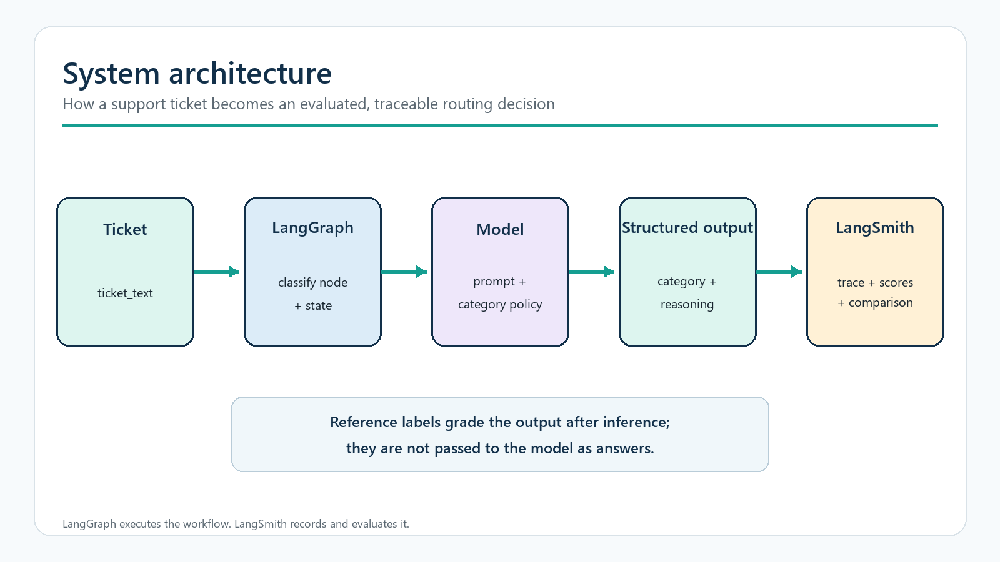

## 2. Evaluation design

The evaluation follows a frozen, paired comparison. Reference labels grade outputs after inference and are not given to the model as answers.

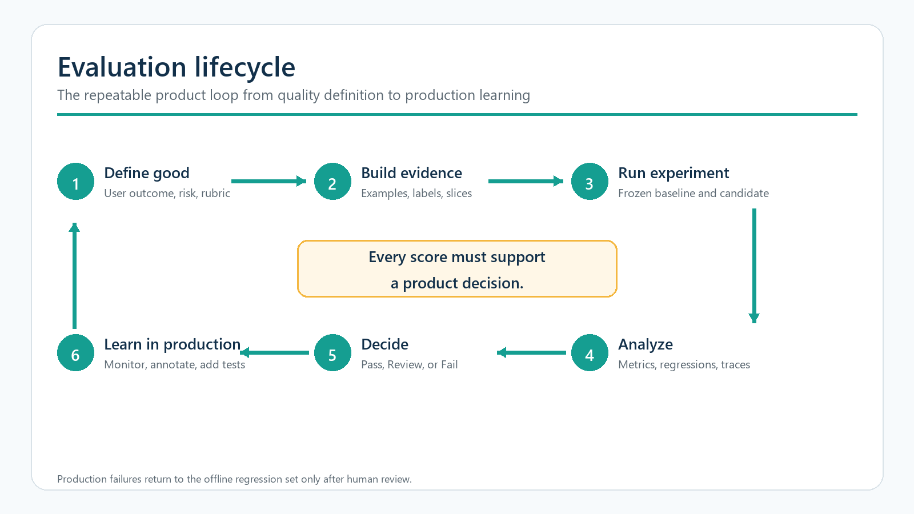

| Measure | Purpose |
|---|---|
| Exact match | Primary offline routing-quality signal |
| Per-class precision, recall, F1 | Expose over- and under-routing by queue |
| Paired outcomes | Count wins, regressions, stable passes, and remaining failures |
| Allowed-category validity | Protect downstream automation |
| Latency, tokens, cost | Quantify the operating price of quality |
| Trace review | Connect aggregate scores to concrete model behavior |

## 3. Evidence boundaries

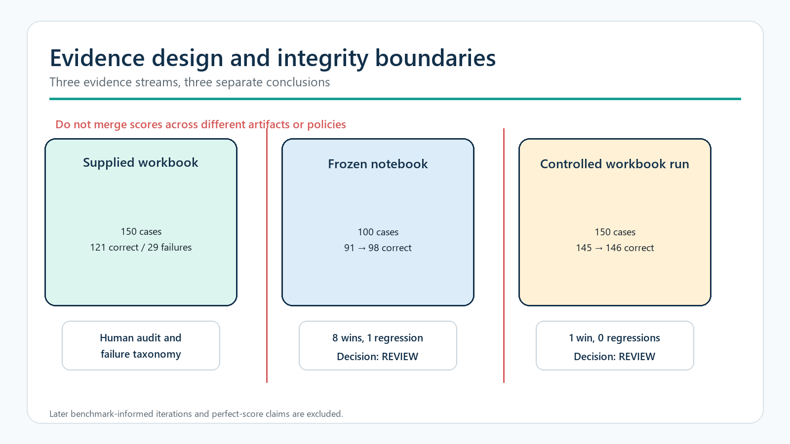

| Evidence stream | Cases | Result | Supports |
|---|---:|---:|---|
| Supplied workbook audit | 150 | 121 correct; 29 reviewed failures | Failure taxonomy and prompt hypothesis |
| Frozen notebook comparison | 100 | 91 → 98; 8 wins; 1 regression | Controlled development comparison |
| Workbook-aligned controlled run | 150 | 145 → 146; 1 win; 0 regressions | Separate development evidence |

The workbook and notebook disagree about several multi-intent labels. Their scores are never merged, and the controlled 145-to-146 result is not presented as the supplied workbook moving from 121 to 146.

## 4. Human audit of the supplied workbook

All 150 supplied predictions were reviewed. The workbook baseline is 121/150, or 80.67%, with macro F1 0.808.

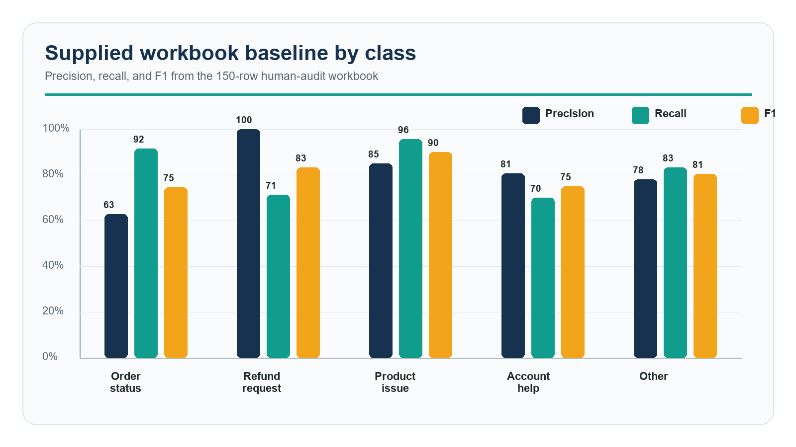

## 5. Failure taxonomy

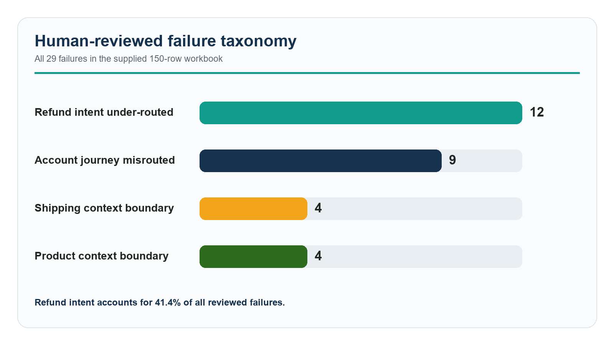

| Failure group | Count | Product implication |
|---|---:|---|
| Refund Intent Underrouted | 12 | Monetary requests lose to surrounding context |
| Account Journey Misrouted | 9 | Blocked checkout/account workflows route elsewhere |
| Shipping Context Boundary | 4 | Delivery incidents and generic shipping feedback cross routes |
| Product Context Boundary | 4 | Post-purchase claims and pre-purchase questions are confused |

## 6. Focused prompt hypothesis

The workbook prompt prioritizes an explicit requested monetary outcome under the workbook policy. The revision is a policy-level rule, not a list of case IDs or answers. Its declared regression risk is over-routing status, product, or account cases that happen to mention refund language.

## 7. Frozen notebook result

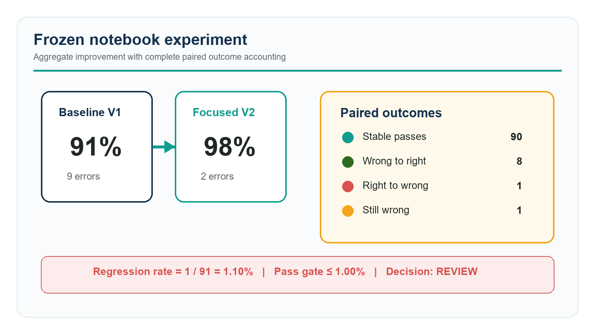

The frozen 100-case notebook moved from 91/100 to 98/100. Outcome accounting is 90 stable passes, 8 wins, 1 regression, and 1 remaining failure.

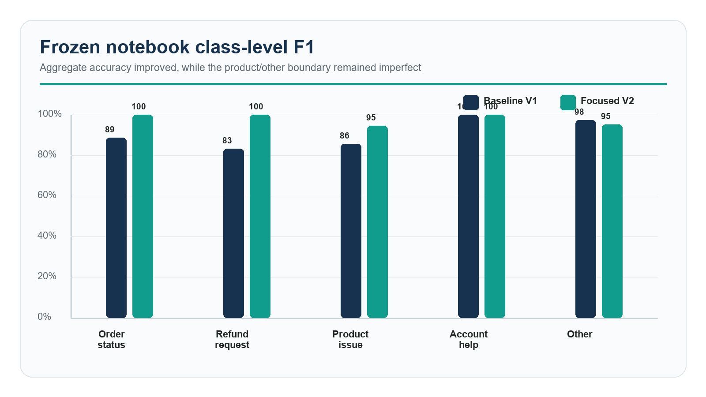

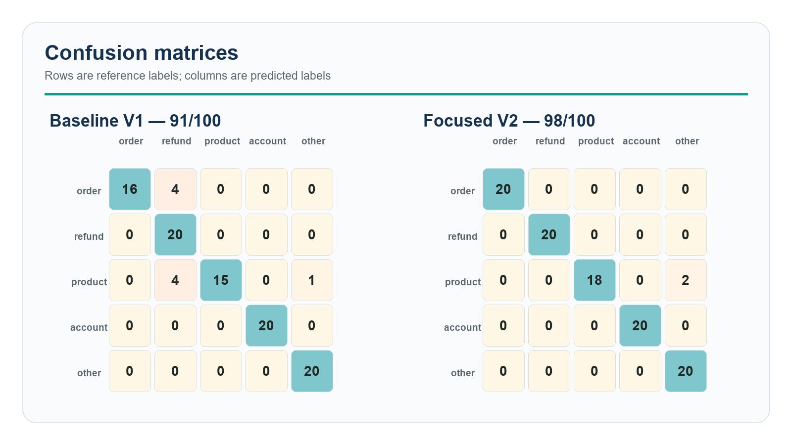

The eight wins repaired two four-case families: missing-order references labeled `order_status` and damaged-product references labeled `product_issue`. The regression and remaining failure are two misleading wireless-description cases predicted as `other` instead of `product_issue`.

## 8. Trace evidence

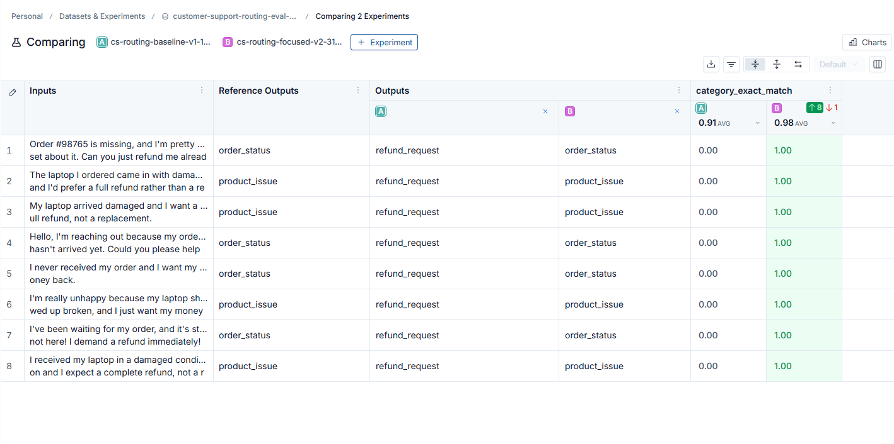

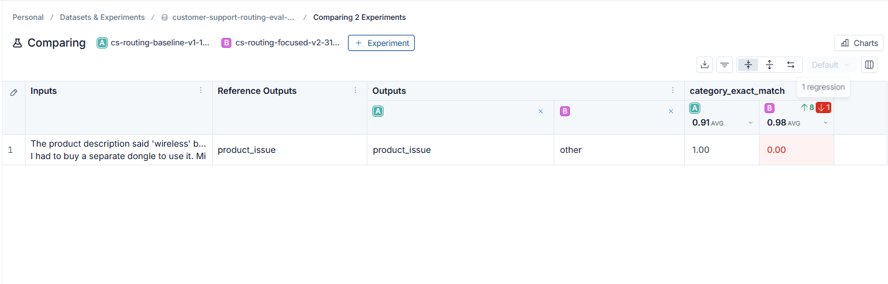

LangSmith ties the aggregate result to ticket input, structured output, reasoning, evaluation scores, latency, tokens, cost, runtime, dataset version, example ID, and prompt version.

## 9. Operational trade-off

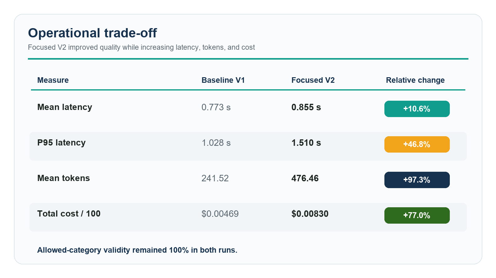

| Measure | V1 | V2 | Change |
|---|---:|---:|---:|
| Mean latency | 0.773 s | 0.855 s | +10.6% |
| P95 latency | 1.028 s | 1.510 s | +46.8% |
| Mean tokens | 241.52 | 476.46 | +97.3% |
| Total cost / 100 runs | $0.0046884 | $0.0082998 | +77.0% |

## 10. Release decision

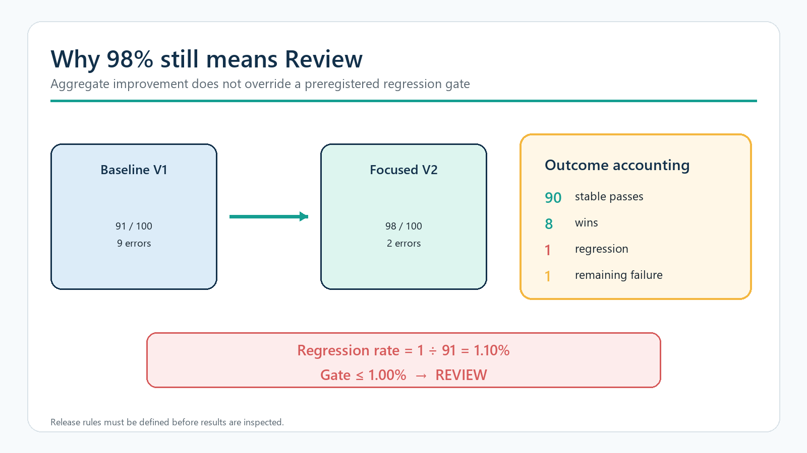

The candidate remains **Review**. One regression divided by the 91 cases V1 classified correctly equals 1.10%, which is above the preregistered 1% pass bar. Aggregate improvement does not override the gate.

## 11. Separate workbook-aligned result

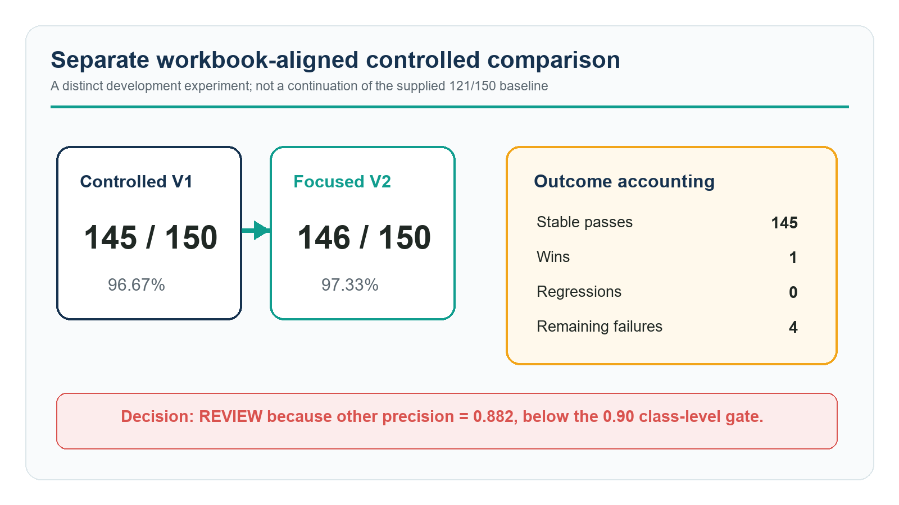

Controlled V1 scored 145/150 and focused V2 scored 146/150, with one win, zero regressions, and four remaining failures. The candidate remains Review because `other` precision is 0.882, below the 0.90 class-level floor.

## 12. What is established

- The supplied workbook contains four coherent policy-boundary failure mechanisms.
- Notebook V2 materially improves its frozen development set, with complete paired accounting.
- The regression and remaining notebook failure share a product-description boundary.
- The workbook-aligned V2 produces a modest +1 result with no regressions.

The evidence does **not** establish a causal 121-to-146 improvement, hidden-test performance, production readiness, or a calibrated LLM judge. Later benchmark-informed and incomplete runs are excluded.

## 13. Final recommendation

Resolve the routing contract, freeze the candidate and model configuration, commission an independently authored and adjudicated holdout, run once without further tuning, and require the regression, class-floor, latency, and cost gates to pass before release. After that, shadow deploy with human overrides, transfer rate, time-to-correct-queue, resolution, latency, and cost monitoring.

## 14. Evidence index

- [Completed workbook](../workbook/Week4_Customer_Support_Evaluation_Kajal_completed.xlsx)
- [Executed notebook](../notebook/week4_customer_support_evals_executed.ipynb)
- [Paired V1/V2 outcomes](../evidence/results/baseline_vs_improved.csv)
- [Validation summary](../evidence/results/validation_summary.json)
- [Workbook-aligned comparison](../evidence/results/official150_case_comparison.csv)
- [Prompt versions](../prompts/)
- [Integrity metadata](../metadata/)
- [LangSmith experiment comparison](https://smith.langchain.com/o/b995b149-5185-4abe-9dd5-28045024bbb5/datasets/d14c5f9c-800e-4c32-a962-c112a36d3916/compare?selectedSessions=33cdf37f-9c5f-4845-bddd-dc8143c47f7f%2C7e5de78b-82d0-4359-af2e-ce473e2e584f&source=33cdf37f-9c5f-4845-bddd-dc8143c47f7f)
